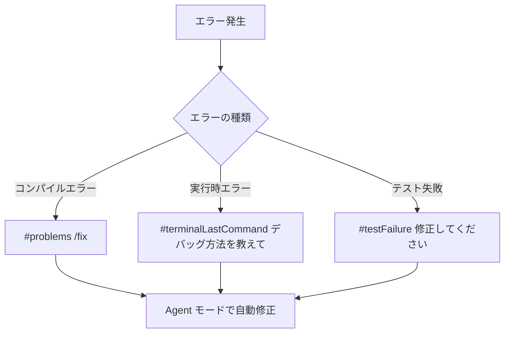

# GitHub Copilot Chat クイックリファレンス

## 学習目標
GitHub Copilot Chat のすべての機能を素早く参照し、効率的に活用できるようになります。

## キーボードショートカット

### 基本操作

| 操作 | Windows/Linux | macOS | 説明 |
|------|---------------|-------|------|
| Chat view を開く | `Ctrl+Alt+I` | `Cmd+Option+I` | サイドバーにChatビューを表示 |
| インラインチャット | `Ctrl+I` | `Cmd+I` | エディタ内で直接チャット |
| Quick Chat | `Ctrl+Shift+Alt+L` | `Cmd+Shift+Option+L` | 素早い質問用 |
| 新しいチャットセッション | `Ctrl+L` | `Cmd+L` | 履歴をクリア |

### エディタ操作

| 操作 | Windows/Linux | macOS | 説明 |
|------|---------------|-------|------|
| 次のコードブロック | `Ctrl+Alt+PageDown` | `Cmd+Option+PageDown` | チャット内のコードブロック間を移動 |
| 前のコードブロック | `Ctrl+Alt+PageUp` | `Cmd+Option+PageUp` | チャット内のコードブロック間を移動 |
| コードを適用 | `Enter` | `Enter` | 提案されたコードを適用 |

## チャットモード

### モード一覧

| モード | 用途 | アクセス方法 |
|--------|------|-------------|
| **Ask** | 質問・説明・理解 | [VS Code Stable](vscode://GitHub.Copilot-Chat/chat?mode=ask) |
| **Edit** | 複数ファイル編集 | [VS Code Stable](vscode://GitHub.Copilot-Chat/chat?mode=edit) |
| **Agent** | 自律的タスク実行 | [VS Code Stable](vscode://GitHub.Copilot-Chat/chat?mode=agent) |

### モード選択ガイド

```
質問がある → Ask モード
ファイルを指定して編集 → Edit モード
複雑なタスクを自動実行 → Agent モード
```

## #-mentions（コンテキスト）

### ビルトインコンテキスト

| コンテキスト | 説明 | 使用例 |
|--------------|------|--------|
| `#file` | 特定のファイルを参照 | `#Calculator.cs このクラスを説明して` |
| `#codebase` | コードベース全体を検索 | `#codebase 認証処理はどこ？` |
| `#selection` | 選択したコードを参照 | `#selection このコードを最適化` |
| `#changes` | 変更内容を参照 | `#changes 変更を要約して` |
| `#problems` | エラー・警告を参照 | `#problems これらを修正` |
| `#terminalLastCommand` | 最後のターミナルコマンド | `#terminalLastCommand なぜ失敗した？` |
| `#testFailure` | 失敗したテストを参照 | `#testFailure 修正方法を提案` |

### Web参照

| コンテキスト | 説明 | 使用例 |
|--------------|------|--------|
| `#fetch` | Webページの内容を取得 | `#fetch https://docs.microsoft.com/...` |
| `#githubRepo` | GitHubリポジトリを検索 | `#githubRepo microsoft/vscode` |

## @-mentions（チャット参加者）

### ビルトイン参加者

| 参加者 | 専門分野 | 使用例 |
|--------|----------|--------|
| `@vscode` | VS Code の使い方 | `@vscode ショートカットを教えて` |
| `@terminal` | ターミナルコマンド | `@terminal gitの履歴を見る方法` |
| `@github` | GitHub関連機能 | `@github PRの作成方法` |

## スラッシュコマンド

### 基本コマンド

| コマンド | 説明 | 使用例 |
|----------|------|--------|
| `/explain` | コードの説明 | `/explain このアルゴリズムを説明` |
| `/fix` | エラーの修正 | `/fix このエラーを修正` |
| `/test` | テストの生成 | `/test 単体テストを作成` |
| `/help` | ヘルプの表示 | `/help` |

## プロンプトパターン集

### 1. コード生成
```
"[何を]を[どのように]実装してください。
要件：
- [要件1]
- [要件2]"
```

### 2. リファクタリング
```
"#file このコードを[目的]のためにリファクタリング。
[制約条件]を維持してください。"
```

### 3. デバッグ
```
"#problems #terminalLastCommand 
この問題を解決してください。"
```

### 4. ドキュメント作成
```
"#file このクラスのXMLドキュメントコメントを
日本語で追加してください。"
```

## Agent モードのツール

### ビルトインツール

| ツール | 機能 | 自動実行内容 |
|--------|------|--------------|
| ファイル操作 | 作成・編集・削除 | プロジェクト構造の生成 |
| ターミナル | コマンド実行 | ビルド、テスト、インストール |
| 問題検出 | エラー・警告の検出 | 自動修正の試行 |
| テスト実行 | テストの実行と分析 | 失敗したテストの修正 |

## 実践的な使用例

### 新機能の追加（Ask → Edit → Agent）

1. **Ask モード**: 設計の相談
   ```
   "キャッシュ機能を追加したいです。
   どのようなパターンがおすすめですか？"
   ```

2. **Edit モード**: 基本実装
   ```
   "ICacheService.cs と MemoryCacheService.cs を作成。
   シンプルなメモリキャッシュを実装してください。"
   ```

3. **Agent モード**: 完全な実装
   ```
   "キャッシュ機能を完成させてください。
   設定、DI登録、テスト、ドキュメントも含めて。"
   ```

### トラブルシューティングフロー



## ベストプラクティス

### 効率的なワークフロー

1. **探索フェーズ**: Ask モードで理解を深める
2. **実装フェーズ**: Edit/Agent モードで実装
3. **検証フェーズ**: Ask モードでレビュー

### コンテキスト管理

```
少ないコンテキスト → 高速だが一般的な回答
多いコンテキスト → 正確だが処理が遅い

バランスが重要！
```

## トラブルシューティング

### よくある問題と解決法

| 問題 | 原因 | 解決法 |
|------|------|--------|
| チャットが応答しない | 拡張機能の問題 | VS Code再起動 |
| 不適切な提案 | コンテキスト不足 | #-mentionを追加 |
| Agent モードが使えない | 設定が無効 | `chat.agent.enabled`を有効化 |
| コードが適用されない | ファイル未保存 | ファイルを保存してから再試行 |

## カスタマイズ

### 設定項目

```json
{
  // チャット関連
  "github.copilot.chat.codesearch.enabled": true,
  "chat.agent.enabled": true,
  "chat.agent.maxRequests": 15,
  
  // 編集関連
  "chat.editing.autoAcceptDelay": 3000,
  
  // ツール関連
  "chat.tools.autoApprove": false,
  "chat.extensionTools.enabled": true
}
```

### カスタム指示ファイル

```markdown
<!-- .github/copilot-instructions.md -->
# プロジェクト固有の指示

- C# 11の機能を積極的に使用
- xUnitでテストを記述
- 日本語でコメントを記述
```

## クイックスタートガイド

### 初心者向け

1. `Ctrl+I` でインラインチャット開始
2. 簡単な質問から始める
3. `/explain` で既存コードを理解

### 中級者向け

1. モードを使い分ける
2. #-mentionでコンテキスト追加
3. Edit モードで効率的な編集

### 上級者向け

1. Agent モードで自動化
2. カスタムモードの作成
3. MCPサーバーの活用

## まとめ

このチートシートを手元に置いて、GitHub Copilot Chat を最大限に活用しましょう。実践を重ねることで、これらの機能が自然に使えるようになります。

**Remember**: 
- 🎯 明確なプロンプト
- 📎 適切なコンテキスト
- 🔄 フィードバックループ
- 🚀 継続的な学習
