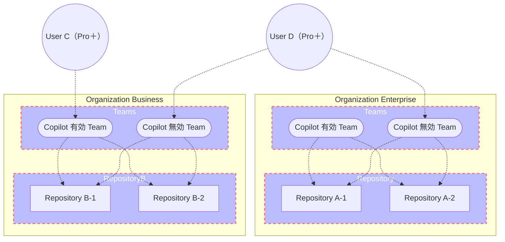
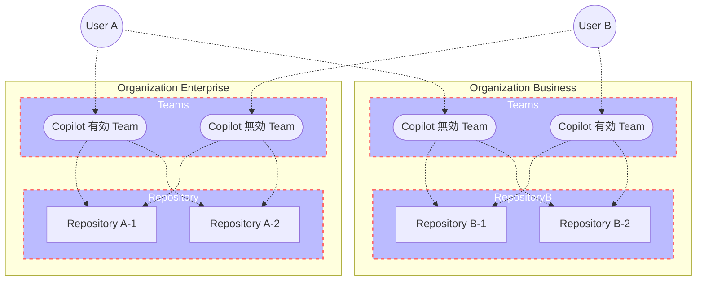
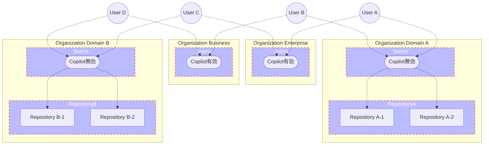

GitHub Copilotの有償ライセンスにはPro・Pro+・Business・Enterpriseの4つがあります。

基本的にはProとPro+が個人で契約するもので、BusinessとEnterpriseは組織で契約するものになります。

これらのライセンスは、きれいに分離・適用されているわけではなく、少し癖のある内容になっています。

というわけで、下記の観点で調査・整理したので、気になる方はご覧ください。

1. Pro+とBusiness両方持っていたらどうなるの？
2. 同一リポジトリで、人によってBusinessとEnterpriseを使い分けられるの？
3. Copilotが有効な人が、Copilotの無効なOrganizationを使ったらどうなるの？
4. おすすめの割当方法は？

他に分からないことがあれば、ぜひコメントでご質問ください。

# 基本概念

ざっくり基本概念を確認してください。

1. ProとPro+は個人アカウントで個別に契約できる（下図ではUser CとUser DがPro+を契約）
2. OrganizationはBusinessかEnterpriseか、いずれか一つの種類だけ割り当てられる
3. Organization内で任意の個人もしくはTeamにCopilotライセンスを割り当てられる（下図ではTeamだけだが、直接個人にも割当可能）
4. プレミアムリクエストは有効になっているライセンス1つ分のみが利用できる

# Q & A

## Pro+とBusiness両方持っていたらどうなるの？

Businessが有効になります。

Pro+の方がBusinessより高機能ですが、Pro+限定の機能は使えませんし、Business側で無効に設定された機能や言語モデルは利用できません。

Pro+の機能は一切使えません。契約は完全に無駄になります。

おそらく組織のガバナンスを優先するためだと思われます。

下図のUser CとUser Dは、いずれもPro+の契約をしています。

User CはBusiness側でCopilotが有効化されているので、Businessの機能しか使えません。

User DはPro+しか割り当てられていないので、すべてのリポジトリでPro+の機能が使えます。

## 同一リポジトリで、人によってBusinessとEnterpriseを使い分けられるの？

使い分けられます。

User AはEnterprise側でCopilotが有効になっており、User BはBusiness側で有効になっています。

このとき、User AはRepository B-1、B-2を使うときEnterpriseの権限で利用できます。

Copilot coding agentのようなEnterprise限定の機能も、Business側のOrganizationのリポジトリでも利用できます。

逆にUser Bは、Enterprise側のリポジトリを使う時でも、Businessの権限内でしか利用できません。

## 一人にBusinessとEnterprise両方割り当てたらどうなる？

Enterpriseだけ有効になります。Businessは割り当て損です。

## Copilotが有効な人が、Copilotの無効なOrganizationを使ったらどうなるの？

有効になります。

別のOrganizationでBusinessもしくはEnterpriseを割り当てていても、個人でProやPro+を契約していても、有効なCopilotのライセンスがあれば、無効なOrganizationのリポジトリでも利用できます。

## おすすめの割当方法は？

2025年5月現在、Copilot割当用のOrganizationと、リポジトリ管理用のOrganizationを分けるのがおすすめです。

下図のような感じです。

こうすることでリポジトリへの権限の割当と、Copilotの割当の組み合わせを、任意に組み合わせることができます。

Copilotの割当とリポジトリへの権限制御はOrganizationで分離するのが、個人的には一番おすすめです。

また、リポジトリ管理用のOrganizationも、何らかのドメイン単位でリポジトリをまとめたほうが良いと思います。[GitHub Copilot Spaces](https://github.blog/jp/2025-05-30-introducing-copilot-spaces-a-new-way-to-work-with-code-and-context/)を有効活用するにはドメイン単位でOrganizationを分け、リポジトリを分類するのが「おそらくは」良いと思います。GitHub Copilot Spacesは出たばかりなので、確実とは言いかねますが。

