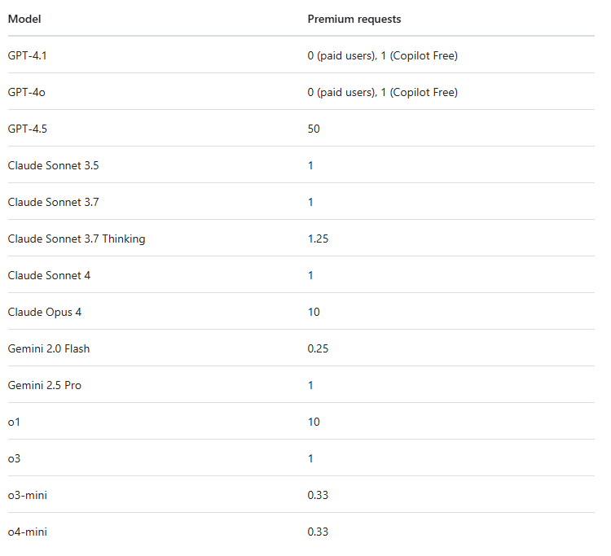

# About premium requests - GitHub Docs

# About premium requests

Learn about premium requests and how they impact your usage and billing.

## In this article

Important

Billing for premium requests will start on **June 18, 2025** for all plans. Until then, you can continue to use Copilot premium models without being billed for additional premium requests.

When billing begins, your premium request counter will be reset to zero and you will be able to track your usage. See [Monitoring your Copilot usage and entitlements](/en/copilot/managing-copilot/monitoring-usage-and-entitlements/monitoring-your-copilot-usage-and-entitlements).

Certain requests may experience rate limits.

-   Rate limits restrict the number of requests that can be made within a specific time period.
-   High demand may result in rate limiting.

## [What is a request?](#what-is-a-request)

A request is any interaction where you ask Copilot to do something for you—whether it’s generating code, answering a question, or helping you through an extension. Each time you send a prompt in a chat window or trigger a response from Copilot, you’re making a request.

If you have Copilot Free enabled, your GitHub account comes with up to 2,000 code completions and up to 50 chats or premium requests per month.

If you're on a paid plan, you get unlimited code completions, unlimited agent requests, and unlimited chat interactions using the base model. Rate limiting is in place to accommodate for high demand. Learn more about [current models and usage](/en/copilot/about-github-copilot/plans-for-github-copilot).

Paid plans also receive a monthly allowance of premium requests, which can be used for advanced chat interactions, code completions using premium models, and other premium features. For an overview of the amount of premium requests included in each plan, see [Plans for GitHub Copilot](/en/copilot/about-github-copilot/subscription-plans-for-github-copilot#comparing-copilot-plans).

## [Premium requests](#premium-requests)

Some Copilot features use more advanced processing power and count as premium requests. The number of premium requests a feature consumes can vary depending on the feature and the AI model used.

### [Premium features](#premium-features)

The following Copilot features can use premium requests:

-   [Copilot Chat](/en/copilot/using-github-copilot/copilot-chat)
-   [Copilot coding agent](/en/copilot/using-github-copilot/coding-agent/about-assigning-tasks-to-copilot) [1](#user-content-fn-1)
-   [Agent mode in Copilot Chat](/en/copilot/using-github-copilot/copilot-chat/asking-github-copilot-questions-in-your-ide#copilot-edits)
-   [Copilot code review](/en/copilot/using-github-copilot/code-review/using-copilot-code-review)
-   [Copilot Extensions](/en/copilot/building-copilot-extensions/about-building-copilot-extensions)

### [Model multipliers](#model-multipliers)

Each model has a premium request multiplier, based on its complexity and resource usage. Your premium request allowance is deducted according to this multiplier.

GPT-4.1 also serves as the base model. If you use all of your premium requests, you can still use Copilot with the base model for the rest of the month. This is subject to change. Response times for the base model may vary during periods of high usage. Requests to the base model may be subject to rate limiting.

## [Additional premium requests](#additional-premium-requests)

Note

The option to purchase additional premium requests is not available to:

-   Users on Copilot Free. To access more premium requests, upgrade to a paid plan.
-   Users who subscribe, or have subscribed, to Copilot Pro or Copilot Pro+ through GitHub Mobile on iOS or Android.

Budget setting for premium requests is coming soon. Until then, you can continue to use Copilot premium models without being billed for additional premium requests.

If you use all of your premium requests, you can still use Copilot with the base model for the rest of the month. If you need more premium requests, you can upgrade to a higher plan or set a spending limit for premium requests over your plan's allowance. Premium requests over the allowance are rejected unless you have set a budget. See [Preventing overspending](/en/billing/managing-your-billing/preventing-overspending).

Additional premium requests beyond your plan’s included amount are billed at $0.04 USD per request.

## [Example of premium request usage](#example-of-premium-request-usage)

Premium request usage is based on the model’s multiplier and the feature you’re using. For example:

-   If you use **GPT-4.5** (50× multiplier) to ask a single question in Copilot Chat, that interaction counts as **50 premium requests**.
-   If you're on **Copilot Free**, even interactions with the **base model** use **1 premium request** each.
-   If you're on a **paid plan**, using the base model does not count against your monthly premium request allowance.

## [Footnotes](#footnote-label)

1.  Copilot coding agent uses a fixed multiplier of 1 for the premium requests it uses, and may use multiple premium requests in response to one user prompt. [↩](#user-content-fnref-1)